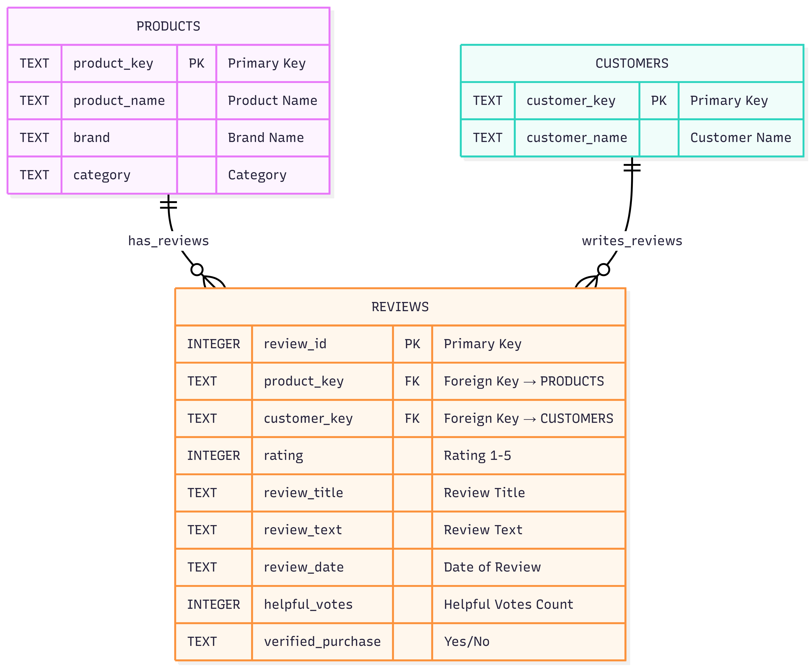

# Product Review Database - Phase 2

## Overview
This database is designed to store product reviews, customer details, and associated product information.  
The schema is normalized into three main tables to ensure data integrity and support future analytics.

## Tables

### 1. Products
Stores product-related information.
- **product_key** (TEXT, PK): Unique identifier for each product
- **product_name** (TEXT, NOT NULL): Name of the product
- **brand** (TEXT, NOT NULL): Brand name
- **category** (TEXT, NOT NULL): Product category

### 2. Customers
Stores customer-related information.
- **customer_key** (TEXT, PK): Unique identifier for each customer
- **customer_name** (TEXT, NOT NULL): Full name of the customer

### 3. Reviews
Stores customer reviews for products.
- **review_id** (INTEGER, PK): Unique identifier for each review
- **product_key** (TEXT, FK → Products.product_key, NOT NULL): Links review to a product
- **customer_key** (TEXT, FK → Customers.customer_key, NOT NULL): Links review to a customer
- **rating** (INTEGER): Rating given by the customer
- **review_title** (TEXT): Title of the review
- **review_text** (TEXT): Content of the review
- **review_date** (TEXT): Date the review was posted
- **helpful_votes** (INTEGER): Number of helpful votes
- **verified_purchase** (TEXT, NOT NULL, 'Yes'/'No'): Indicates if the review is from a verified purchase

## Relationships (ERD)

- **Customers 1 → * Reviews**: Each customer can write multiple reviews.
- **Products 1 → * Reviews**: Each product can have multiple reviews.

## Design Considerations
- Tables are normalized to reduce data redundancy.
- Primary Keys (PK) ensure each record is unique.
- Foreign Keys (FK) enforce referential integrity.
- Schema supports analytical queries such as:
  - Aggregating reviews per product
  - Fetching all reviews by a customer
  - Calculating average rating per product

## Deliverables
- `database/schema.sql` : SQL script to create all tables with constraints
- `database/schema_erd.png` : ERD diagram illustrating table relationships